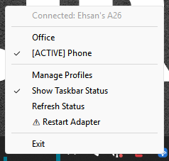
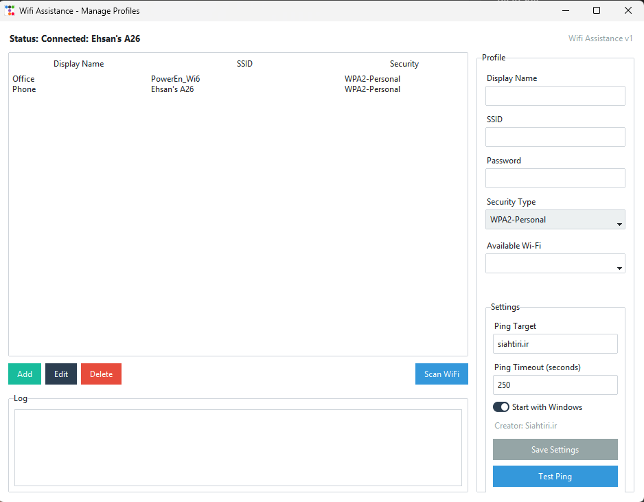

# Wifi Assistance

نسخه: 1  
سازنده: Siahtiri.ir

**Wifi Assistance** یک نرم‌افزار سبک ویندوزی برای مدیریت سریع اتصال به Wi-Fi است. برنامه در System Tray اجرا می‌شود، وضعیت واقعی اتصال فعلی را از ویندوز می‌خواند، و به شما اجازه می‌دهد بین پروفایل‌های Wi-Fi ذخیره‌شده سریع جابه‌جا شوید.

## تصاویر نرم‌افزار

### نمایشگر زنده کنار Taskbar


### منوی راست‌کلیک System Tray



### پنجره مدیریت پروفایل‌ها



## قابلیت‌ها

- اجرا در System Tray ویندوز.
- نمایشگر کوچک و همیشه‌روی‌صفحه کنار Taskbar برای نمایش Wi-Fi فعلی.
- نمایش پروفایل فعال در منوی Tray با علامت `[ACTIVE]`.
- خواندن وضعیت واقعی اتصال از `netsh wlan show interfaces`.
- افزودن، ویرایش و حذف پروفایل‌های Wi-Fi.
- اسکن شبکه‌های Wi-Fi اطراف.
- ساخت یا استفاده دوباره از پروفایل‌های Wi-Fi ویندوز.
- اتصال واقعی با `netsh wlan connect`.
- بررسی واقعی اتصال بعد از تغییر پروفایل.
- تست Ping با آدرس و timeout قابل تنظیم.
- چشمک‌زدن دایره وضعیت هنگام تست Ping.
- نمایش لاگ عملیات اتصال، Ping و Restart Adapter.
- اجرای خودکار با شروع ویندوز.
- گزینه Restart Adapter در منوی Tray.

## پیش‌نیازها

- Windows
- Python 3.10 یا بالاتر
- فعال بودن سرویس WLAN AutoConfig
- کارت Wi-Fi فعال

## نصب برای اجرای سورس

```powershell
cd wifi_quick_switcher
python -m venv .venv
.\.venv\Scripts\activate
pip install -r requirements.txt
```

## اجرا

```powershell
python main.py
```

بعد از اجرا، برنامه در System Tray قرار می‌گیرد. با راست‌کلیک روی آیکون می‌توانید وضعیت اتصال را ببینید، بین پروفایل‌ها جابه‌جا شوید، پنجره مدیریت پروفایل‌ها را باز کنید، نمایشگر Taskbar را روشن یا خاموش کنید، وضعیت را Refresh کنید یا برنامه را ببندید.

## ساخت فایل exe

```powershell
pyinstaller --noconfirm --onefile --windowed --name "WifiAssistance" main.py
```

خروجی در مسیر زیر ساخته می‌شود:

```text
dist\WifiAssistance.exe
```

## ساخت Installer با Inno Setup

```powershell
& "C:\Program Files (x86)\Inno Setup 6\ISCC.exe" .\WifiAssistance.iss
```

خروجی Installer:

```text
installer\WifiAssistanceSetup.exe
```

## محل ذخیره‌سازی اطلاعات

پروفایل‌ها:

```text
%APPDATA%\WifiAssistance\profiles.json
```

تنظیمات:

```text
%APPDATA%\WifiAssistance\settings.json
```

نمونه تنظیمات:

```json
{
  "ping_target": "siahtiri.ir",
  "ping_timeout_seconds": 250,
  "start_with_windows": true,
  "creator": "Siahtiri.ir"
}
```

نمونه پروفایل:

```json
[
  {
    "display_name": "Home",
    "ssid": "Home_WiFi",
    "password": "12345678",
    "security_type": "WPA2-Personal"
  }
]
```

> رمزهای Wi-Fi در نسخه فعلی به‌صورت Plain Text داخل JSON ذخیره می‌شوند. این روش برای نسخه Production توصیه نمی‌شود و بهتر است در آینده با Windows Credential Manager یا رمزنگاری جایگزین شود.

## نکات مهم

- این برنامه فقط برای Windows طراحی شده است.
- بعضی خروجی‌های `netsh` ممکن است بر اساس زبان ویندوز متفاوت باشند.
- Restart Adapter ممکن است در بعضی سیستم‌ها نیاز به دسترسی Administrator داشته باشد.
- منوی Tray با `pystray` از منوی native ویندوز استفاده می‌کند؛ بنابراین رنگ‌دهی مستقیم به آیتم فعال داخل منوی راست‌کلیک امکان‌پذیر نیست.

---

# Wifi Assistance

Version: 1  
Creator: Siahtiri.ir

**Wifi Assistance** is a lightweight Windows utility for quickly managing Wi-Fi connections. The app runs in the System Tray, reads the real current connection status from Windows, and lets you quickly switch between saved Wi-Fi profiles.

## Screenshots

### Live Taskbar Status


### System Tray Context Menu


### Profile Management Window


## Features

- Runs in the Windows System Tray.
- Shows a small always-on-top Wi-Fi status widget near the taskbar.
- Marks the active Tray profile with `[ACTIVE]`.
- Reads the real connection status from `netsh wlan show interfaces`.
- Adds, edits, and deletes Wi-Fi profiles.
- Scans nearby Wi-Fi networks.
- Creates or reuses Windows Wi-Fi profiles.
- Connects with `netsh wlan connect`.
- Verifies the real connection after switching profiles.
- Supports a configurable Ping target and timeout.
- Blinks the status dot while Ping is running.
- Shows logs for connection, Ping, and Restart Adapter operations.
- Can start automatically with Windows.
- Includes a Restart Adapter action in the Tray menu.

## Requirements

- Windows
- Python 3.10 or newer
- WLAN AutoConfig service enabled
- A working Wi-Fi adapter

## Install From Source

```powershell
cd wifi_quick_switcher
python -m venv .venv
.\.venv\Scripts\activate
pip install -r requirements.txt
```

## Run

```powershell
python main.py
```

After launch, the app stays in the System Tray. Right-click the Tray icon to view connection status, switch profiles, open profile management, show or hide the taskbar widget, refresh status, or exit the app.

## Build EXE

```powershell
pyinstaller --noconfirm --onefile --windowed --name "WifiAssistance" main.py
```

The executable is created here:

```text
dist\WifiAssistance.exe
```

## Build Installer With Inno Setup

```powershell
& "C:\Program Files (x86)\Inno Setup 6\ISCC.exe" .\WifiAssistance.iss
```

Installer output:

```text
installer\WifiAssistanceSetup.exe
```

## Data Storage

Profiles:

```text
%APPDATA%\WifiAssistance\profiles.json
```

Settings:

```text
%APPDATA%\WifiAssistance\settings.json
```

Settings example:

```json
{
  "ping_target": "siahtiri.ir",
  "ping_timeout_seconds": 250,
  "start_with_windows": true,
  "creator": "Siahtiri.ir"
}
```

Profile example:

```json
[
  {
    "display_name": "Home",
    "ssid": "Home_WiFi",
    "password": "12345678",
    "security_type": "WPA2-Personal"
  }
]
```

> Wi-Fi passwords are stored as plain text in JSON in the current version. This is not recommended for production and should be replaced later with Windows Credential Manager or encryption.

## Notes

- This app is designed only for Windows.
- Some `netsh` output can vary depending on the Windows display language.
- Restart Adapter may require Administrator permission on some systems.
- The Tray menu uses the native Windows menu through `pystray`; direct per-item coloring for the active right-click menu item is not supported.
